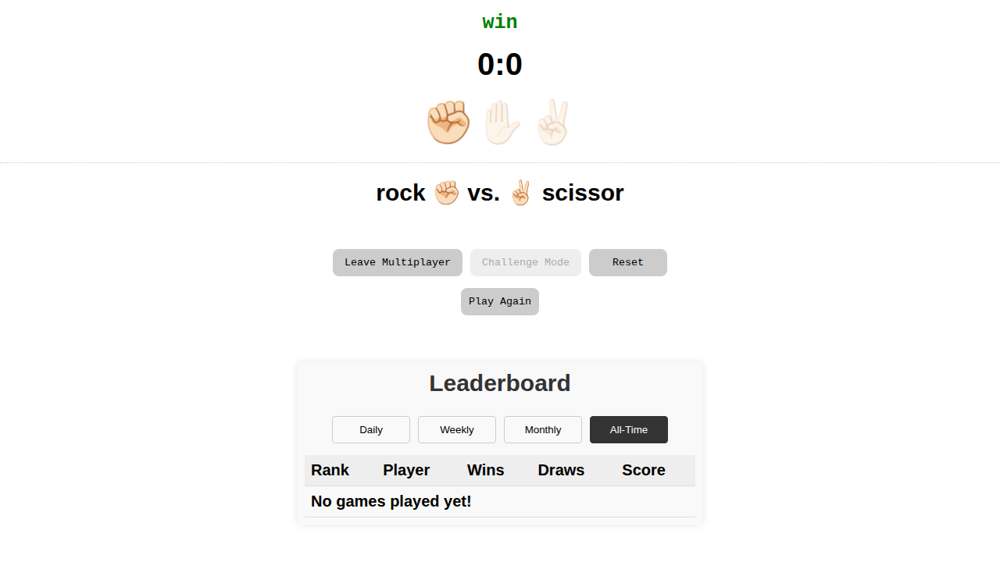

# Rock Scissor Paper Game (Full-Stack Multiplayer)

I originally wrote this Rock Scissor Paper game in ReactJS a long time ago for a job interview. Now, I have completely rewritten and optimized it as a modern Senior React Developer using modern hooks, strict TypeScript, Vite, and a custom Node.js/Express backend for real-time multiplayer!

## Play Online Immediately!

Don't want to install locally? Try it instantly online. **Note:** Since this app now uses a custom Node.js backend for multiplayer and leaderboards, we recommend using CodeSandbox or Glitch over StackBlitz for full compatibility:

- [](https://codesandbox.io/s/github/AlexioVay/RockScissorPaper)
- [](https://glitch.com/edit/#!/import/github/AlexioVay/RockScissorPaper)

## Features

- **Real-Time Multiplayer:** Enter a unique username to join the matchmaking queue and play against real opponents online!
- **Hidden Choices:** Your opponent's weapon is hidden until both players have made their selection.
- **Global Leaderboards:** Track the top players with Daily, Weekly, Monthly, and All-Time leaderboards, complete with automatically detected country flags 🏳️!
- **Challenge Mode (Reaction Game):** Counter the computer's slowly revealing gesture before time runs out using keyboard (`Q`, `W`, `E`) or mouse!
- **Player vs. Computer:** Play the classic game against the computer.
- **Persistent State:** Single-player game score is saved in your browser's session storage and remains even when you refresh the page.
- **Responsive:** Works seamlessly on Desktop and Mobile.

## Preview



## Tech Stack

- React 19+
- TypeScript
- Vite
- Node.js & Express (Backend)
- Concurrent execution (`concurrently`)
- CSS Modules / Standard CSS

## Getting Started

To run this project locally:

1. **Clone the repository:**
   ```bash
   git clone <repo-url>
   cd RockScissorPaper
   ```

2. **Install dependencies:**
   ```bash
   npm install
   ```

3. **Start the development server:**
   ```bash
   npm run dev
   ```

4. **Build for production:**
   ```bash
   npm run build
   ```

Have fun playing!
